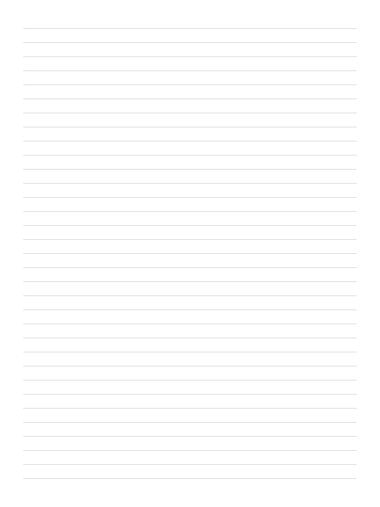
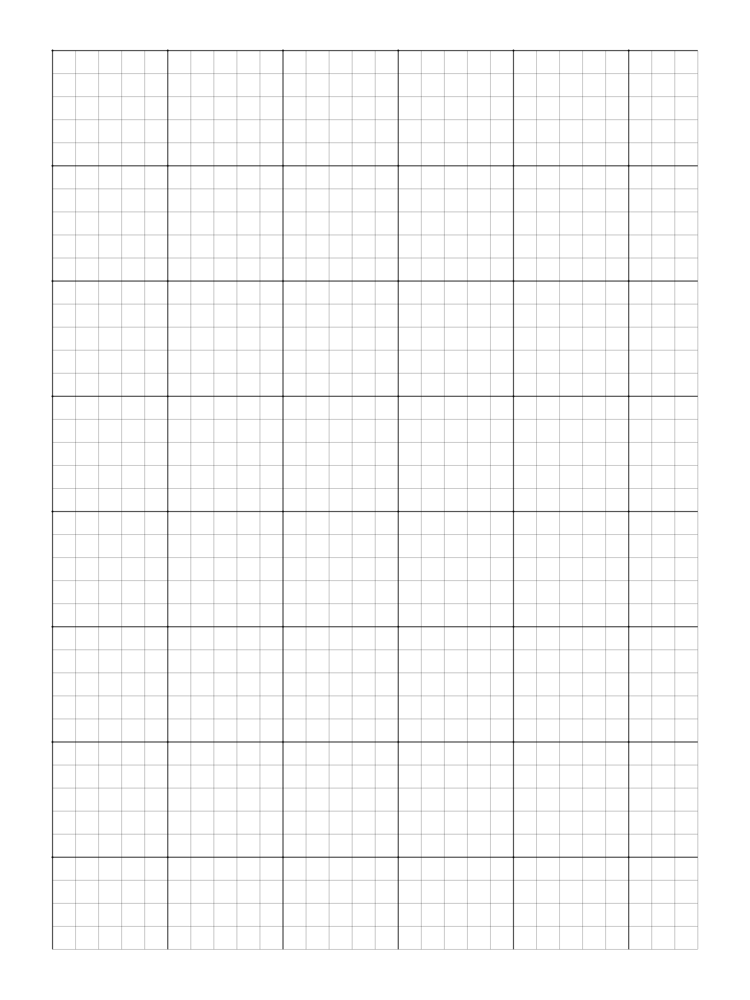

# Table of Contents

1.  [About](#orgb49ad43)
2.  [Why This Tool?](#orgf062469)
3.  [What this tool is NOT](#orgaeb4f60)
4.  [Features](#org8c2c9a5)
5.  [Installation](#orgc977ff5)
6.  [Full Documentation](#org9c9be0a)
7.  [Supported Devices](#org4d3fd7b)
8.  [Configuration](#orgf812c59)
9.  [Usage Examples](#org223eac5)
    1.  [Basic Templates](#org6a8e515)
10. [Output](#org3962a62)
11. [Contributing](#org8cf8926)
12. [License](#org580845e)
13. [Credits](#org2b8cb51)

# About

A device-agnostic command-line tool for generating mathematically balanced, pixel-perfect page templates for e-ink devices. Developed with the Supernote Manta, this tool supports millimeter or pixel specifications for human-readable, technically-precise, or true-scale template configurations.

# Why This Tool?

This tool was born from the frustration of online generators that fail to handle "half-lines" or pixel alignment, resulting in uneven, blurry, or aliased lines on high-DPI e-ink screens. This generator calculates exact pixel-perfect margins and spacing based on your device's specific resolution and DPI, ensuring every line is crisp and uniform.

:SUMMARY: Click to see Visual Comparison: The "Why"

**Problem: Blurry Lines (Fractional Pixels)**
The image on the left (`--no-auto-adjust`) shows blurry, anti-aliased lines. The image on the right (default) shows the pixel-perfect, crisp lines this tool creates.

<table border="2" cellspacing="0" cellpadding="6" rules="groups" frame="hsides">

<colgroup>
<col  class="org-left" />

<col  class="org-left" />
</colgroup>
<thead>
<tr>
<th scope="col" class="org-left">"Before" (Blurry)</th>
<th scope="col" class="org-left">"After" (Pixel-Perfect)</th>
</tr>
</thead>
<tbody>
<tr>
<td class="org-left"></td>
<td class="org-left"></td>
</tr>
</tbody>
</table>

**Problem: Grid Misalignment**
The image on the left (default) shows a grid being awkwardly cut off. The image on the right (`--force-major-alignment`) shows the margins being automatically adjusted to end perfectly on a major grid line.

<table border="2" cellspacing="0" cellpadding="6" rules="groups" frame="hsides">

<colgroup>
<col  class="org-left" />

<col  class="org-left" />
</colgroup>
<thead>
<tr>
<th scope="col" class="org-left">"Before" (Misaligned)</th>
<th scope="col" class="org-left">"After" (Force-Aligned)</th>
</tr>
</thead>
<tbody>
<tr>
<td class="org-left"></td>
<td class="org-left"></td>
</tr>
</tbody>
</table>

:END:

# What this tool is NOT

-   Calendar/Schedule Generator
-   Task/To Do list Generator
-   Color e-ink Template Generator (yet)
-   Real-Time GUI Editor
-   Monetized or Paywalled Tool

# Features

-   **Pixel-Perfect Alignment:** Automatically adjusts margins and spacing to eliminate blurry lines and aliasing artifacts.
-   **Multiple Template Types:** Generate lined, dotgrid, grid, manuscript, french ruled, music staff, isometric, hexgrid, and hybrid pages.
-   **Flexible Layouts:** Create single pages, uniform N x M grids, mixed-type grids, and complex, ratio-based layouts using JSON.
-   **Decorative Title Pages:** Generate artistic cover pages using Truchet tiles, L-System fractals, noise fields, and more.
-   **Powerful Customization:** Add major/minor lines, decorative separators, line numbers, and axis labels.
-   **Flexible Spacing:** Define layouts using millimeters (default), exact pixels, or by fitting an exact line count.

# Installation

    pip install eink-template-gen

# Full Documentation

For detailed guides, feature deep-dives, and advanced examples, please see the `docs/` directory:

-   **Features**
    -   [Template Types](docs/features/template-types.md)
    -   [Flexible Layouts](docs/features/layouts.md)
    -   [Decorative Title Pages](docs/features/title-pages.md)
-   **Guides**
    -   [Customization Options (Separators, Labels, etc.)](docs/guides/customization.md)
    -   [Spacing Modes (mm, px, line count)](docs/guides/spacing-modes.md)
-   **Examples**
    -   [Advanced Usage Examples](docs/advanced-examples.md)
-   **Reference**
    -   [Command Reference (All Flags)](docs/reference/command-reference.md)
    -   [Technical Details (Algorithm, Palette)](docs/reference/technical-details.md)

# Supported Devices

Built-in device profiles:

-   Supernote Manta (10.7", 1920x2560, 300 DPI)
-   Supernote A5 X (10.3", 1404x1872, 226 DPI)
-   Supernote A6 X (7.8", 1404x1872, 300 DPI)
-   Supernote Nomad (7.8", 1404x1872, 300 DPI)

# Configuration

Set a default device to avoid specifying `--device` every time:

    eink-template-gen util set-default-device manta
    eink-template-gen util set-default-margin 10

Configuration is stored locally in `config.json`.

# Usage Examples

## Basic Templates

    # Simple lined paper
    eink-template-gen lined --spacing 7mm
    
    # Dot grid with major crosshairs
    eink-template-gen dotgrid --spacing 5mm --major_every 5
    
    # Graph paper with axis labels
    eink-template-gen grid --spacing 5mm --major_every 5 --axis-labels
    
    # Manuscript paper for handwriting practice
    eink-template-gen manuscript --spacing 8mm

For more complex examples, including `multi`, `layout`, and `title` commands, see the [Advanced Usage Examples](docs/advanced-examples.md) documentation.

# Output

Templates are saved to `out/<device_id>/` by default:

    out/
    ├── manta/
    │   ├── lined_7mm_0_5px.png
    │   ├── grid_5mm_0_5px_h-wavy.png
    │   └── title_truchet_10mm_seed42.png
    └── a5x/
        └── lined_6mm_71px.png

Use `--output-dir` and `--filename` to customize output location.

# Contributing

Contributions are welcome! This project uses:

-   Cairo for high-quality 2D graphics rendering
-   Python 3.8+
-   Pure Python implementation (no external dependencies for noise/fractals)

# License

This project is licensed under the **GNU General Public License v3.0**. See the `LICENSE` file for details.

# Credits

Developed for the Supernote community with love for pixel-perfect templates.

